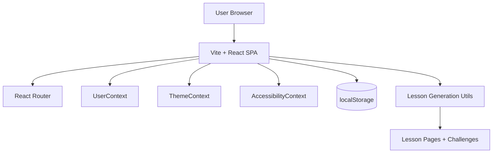

# System Architecture

This document describes the current architecture of the SkillTree application.

## 1) High-Level Overview

SkillTree is primarily a client-side React application built with Vite. It uses React Router for navigation, React Context for app-wide state, and browser `localStorage` for lightweight persistence.

There is no production backend service currently wired into app routing. Lesson generation is currently performed in frontend utilities (and a standalone backend-like component exists in `src/backend/server.js`, but it is not a deployed API server).

## 2) Architecture Diagram

## 3) Core Building Blocks

- **Application Shell**
  - Entry point: `src/main.jsx`
  - Root routing and page composition: `src/App.jsx`
- **Feature UI Layer**
  - Pages/components in `src/components/` (onboarding, dashboard, lesson, profile, accessibility)
- **State Layer**
  - `src/Context/UserContext.jsx` for user/session/progress state
  - `src/Context/ThemeContext.jsx` for light/dark mode
  - `src/Context/AccessibilityContext.jsx` for accessibility preferences
- **Domain/Logic Layer**
  - `src/utils/generateLessons.js`
  - `src/utils/generateLessonChallenge.js`
  - `src/utils/evaluateAnswer.js`
- **Persistence Layer**
  - Browser `localStorage` (client-side persistence)

## 4) Runtime Flow

1. User opens SPA and enters onboarding flow (`SignIn` / `CreateAccount` / `Career` / optional `Upload`).
2. User answers and profile info are placed into Context + localStorage.
3. Lesson utilities generate skill tree content and challenge data.
4. User progresses through dashboard and lesson routes.
5. Accessibility and theme preferences are applied globally through Context providers.

## 5) External Dependencies

- Framework/runtime: React 19 + Vite
- Routing: React Router v6
- UI/UX: Framer Motion, Radix UI, Lucide
- Sanitization: DOMPurify
- Styling: Tailwind CSS + PostCSS/Autoprefixer

## 6) Deployment Model

- Target platform: static hosting (Vercel, based on current repository config)
- Build artifact: `dist/`
- App type: single-page application with rewrite to `/`

## 7) Current Constraints and Risks

- Authentication is client-side only (not production-grade).
- Progress/session data relies on localStorage (device/browser scoped).
- No stable backend API for persistent user data.
- `src/backend/server.js` is a React component, not an Express/Node API server.
- If an API key is used directly in frontend runtime, it is exposed to clients; move sensitive calls to a backend service.

## 8) Recommended Target Architecture (Next Step)

Near-term improvement path:

1. Add a minimal backend API (`/api/auth`, `/api/progress`, `/api/lessons`).
2. Move AI calls and secret keys to server-side only.
3. Persist users, progress, and lesson outcomes in a database.
4. Replace client-only auth with secure session or token-based auth.

