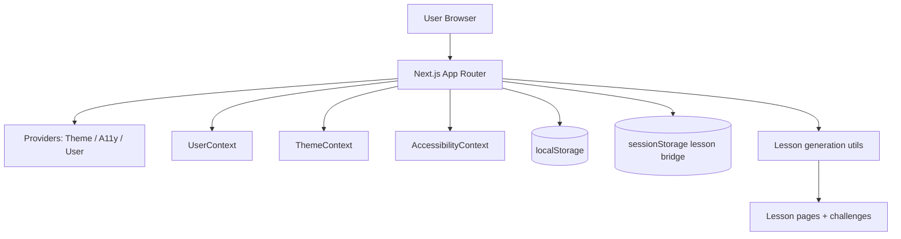

# System Architecture

This document describes the current architecture of the SkillTree application.

## 1) High-Level Overview

SkillTree is a **Next.js 15 (App Router)** application: file-based routes under `app/`, shared providers in `app/providers.jsx`, and React Context for client state. Persistence uses browser **`localStorage`** (and **`sessionStorage`** for one-shot lesson navigation payloads).

There is no production backend API in the routing layer. Lesson generation runs in client utilities and optional OpenAI calls; `src/backend/server.js` is a **React component** (legacy name), not an HTTP server.

## 2) Architecture Diagram

## 3) Core Building Blocks

- **Application shell**
  - Root layout: `app/layout.jsx` (metadata, `metadataBase`, global CSS)
  - Providers: `app/providers.jsx` (client boundaries)
- **Routes**
  - `app/**/page.jsx` — see README for URL map
- **Feature UI**
  - `src/components/` — onboarding, dashboard, lesson, profile, accessibility
- **State**
  - `src/Context/UserContext.jsx`, `ThemeContext.jsx`, `AccessibilityContext.jsx`
- **Domain / logic**
  - `src/utils/generateLessons.js`, `generateLessonChallenge.js`, `evaluateAnswer.js`
- **Navigation bridge**
  - `src/lib/lessonNavigation.js` — replaces React Router `location.state` for lesson deep links

## 4) Runtime Flow

1. User opens the app and goes through onboarding (`/signin`, `/create-account`, `/career`, optional `/upload`).
2. Context + `localStorage` hold profile and progress.
3. Lesson utilities generate tree content and challenges (optionally calling AI when configured).
4. User navigates dashboard and `/lesson/[title]` routes; lesson context may be passed via `sessionStorage` + encoded title.

## 5) External Dependencies

- **Framework:** Next.js 15, React 19
- **UI / motion:** Framer Motion, Radix UI, Lucide
- **Sanitization:** isomorphic-dompurify
- **Styling:** Tailwind CSS v4 + PostCSS

## 6) Deployment Model

- **Target:** Vercel (or any Node host running `next start`)
- **Build output:** `.next/` (not a static `dist/` export unless explicitly configured)
- **CI:** GitHub Actions — lint, Prettier check, `next build` (see `.github/workflows/ci.yml`)

## 7) Current Constraints and Risks

- Authentication is client-side only (not production-grade).
- Progress is device-scoped via `localStorage`.
- No first-class backend for durable user data.
- **`NEXT_PUBLIC_` API keys are visible in the browser**; production systems should proxy AI calls through server routes or a backend.

## 8) Recommended Target Architecture

1. Add Route Handlers or a BFF: `/api/lessons`, `/api/progress`.
2. Move AI calls and secrets server-side; use short-lived tokens for the client if needed.
3. Persist users and progress in a database (e.g. via Neon, Postgres, or a hosted auth product).
4. Replace demo auth with session-based or token auth aligned to your threat model.
